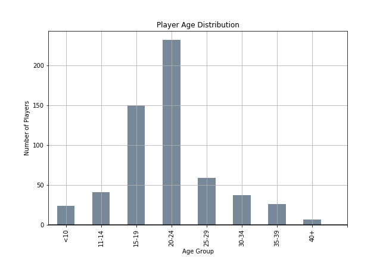

# Heroes of Pymoli

Analysis of player demographics, in-app purchases and popular items in the game Heroes of Pymoli

## Player Demographics

The majority of players are male and between the ages of 15-24. 

Gender | Player Count | Percentage
---|---|---
Male | 484 | 84.03%
Female | 81 | 14.06%
Other / Non-Disclosed | 11 | 1.91%

## Purchase Analysis

The average purchase is $3.05.
Spending on items does not vary significantly between ages and genders.

The average purchase per player is $4.13, the five players with the highest purchase values range from $13.10-$18.96. 
This is more than 3 times the average purchase.

## Popular Items

The three most profitable items are also three of the most popular, 
meaning higher prices do not deter players from buying good items.
